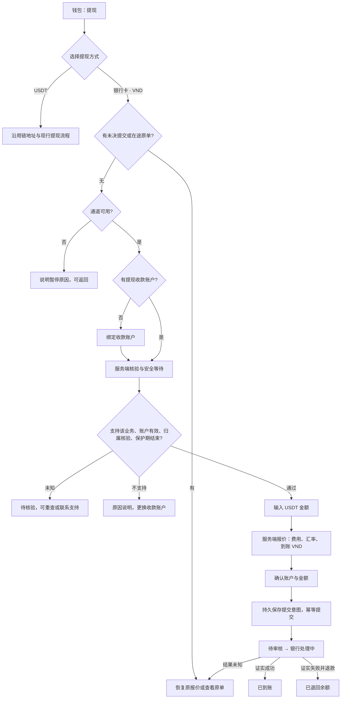

# 越南银行卡提现：调研与增量设计

状态：设计草案，待服务商资料核对与产品确认。调研日期：2026-09-16。

本稿交付市场判断、前后台功能契约和[可点交互原型](prototypes/vietnam-bank-withdrawal.html)。不表示真实银行通道已开通，不修改现行钱包政策，不授权部署或真实转账。

## 1. 结论与推荐范围

1. 钱包点击「提现」后选择「USDT」或「银行卡 · VND 到账」。银行卡分支实质是**向越南银行收款账户转账**，优先绑定支付账户号，不是拿现有 Visa/Mastercard 支付卡 token 出款。
2. 不能用「储蓄卡可提现、信用卡只可充值」作二分规则。卡组织、卡种、银行、账户状态、支付通道、商户业务准入是不同维度；充值与提现分别判断。
3. 后台 `test` 已有 HDPay/BANKQR 银行代付、银行账户绑定、报价、订单、D2 审核与 D7 配置；正式 APP `test` 也已有接入。应复用这些能力，重整方式选择入口并补账户能力验证，不重复造一套资金系统。
4. 当前关键缺口是：绑定只验证字符串格式，尚不能证明账户存在、归属、类型和收款能力；代付真实启用仍 HOLD。**24 小时到期不等于账户验证通过。**
5. 本次增量以现有服务端 **USDT 可提现余额扣账 → VND 银行到账** 为接口设计基线；金额资格继续取现行服务端政策，不扩大本金可提范围，不改 VND 主账，不启用信用卡钱包充值，不增第三方收款、多账户轮换或自动换通道重打。

主人已说明有服务商，将补充名称和接口资料。源码中的 HDPay 是已核实的技术现状；是否为本次最终签约方、银行覆盖范围及账户验证接口尚未确认。

## 2. 越南市场：哪些能收款，哪些能支付

### 2.1 必须区分的对象

| 对象 | 银行提现设计 | 充值或消费设计 | 依据与限制 |
|---|---|---|---|
| 本人越南 VND 支付账户（通常关联借记卡/ATM 卡） | 首选候选；需账户可收款、通道覆盖和归属核验通过 | 银行转账入金另走获准的收款业务 | NAPAS 提供卡/账户实时转账；并非每张卡、每个商户都自动获准 [S1][S2] |
| NAPAS 境内借记卡 | 首发建议收账户号；若以后收卡号，必须确认该发卡行与代付商支持卡号入账 | 境内卡支付能力不能替代钱包充值准入 | NAPAS 官方将借记卡与信用卡分开说明 [S1] |
| Visa/Mastercard 等国际借记卡 | 其关联越南支付账户可以成为候选；卡号出款是另一条需单独开通和查资格的轨道 | 合法商品支付按收单方准入；钱包充值另核 | 品牌标识或 BIN 不能证明本卡可接商户代付 [S4] |
| 越南信用卡（境内或国际品牌） | 本次不作为提现受益账户；能收还款或原路退款不等于可接钱包出款 | **不能直接标成「仅支持充值」**；合法商品消费与钱包充值不同 | 2026 生效修订禁止使用信用卡向支付账户、借记卡、预付卡、电子钱包转账/贷记 [S3]；信用卡还款是另一用途 [S5] |
| 实名预付卡 | 首发不开放；只有合作方逐产品证明可接代付才另评估 | 按发卡行协议及收单业务范围 | 不因实名或有卡号就推断可提现 [S3] |
| 匿名预付卡 | 不开放 | 不作为 APP 在线充值手段 | 现行规则限越南境内 POS 合法商品服务支付，禁止电子方式交易及取现 [S3] |
| 无实体卡的银行账户 | 可作为候选，不要求先办一张塑料卡 | 银行转账能力按账户/通道判断 | 账户转账与卡号转账是不同入口 [S2] |
| 定期存款、贷款/信用卡还款账户、外币账户、境外账户、停用/冻结账户 | 不归入首发 VND 支付账户范围；无法判定时待核验 | 不自动增加任何充值能力 | 产品范围建议；具体限制以银行和签约方为准 |

“银行卡提现”可以作为熟悉的入口名称；表单字段应使用「收款账户 / Số tài khoản」，避免把「卡号 / Số thẻ」与账户号混淆。越南通常所说的支付账户 `tài khoản thanh toán` 不等于定期储蓄账户。

银行自身条款也支持这种区分：TPBank 于 2026-06-11 生效的条款将钱包充值来源写为本人 VND 支付账户或境内借记卡，将钱包提现目的地写为本人 VND 支付账户；前提是钱包服务商获准且与该行建立连接 [S8]。这是账户模型的现实依据，不是 NexGrid 已获 TPBank 受理的证明。

### 2.2 银行覆盖：可验证的结论与尚不能给出的结论

公开支付商出款资料列有 Vietcombank、BIDV、VietinBank、Techcombank、MB、ACB、VPBank、Sacombank、Agribank、HDBank、TPBank、VIB 等银行账户目的地 [S6]。这可以证明越南银行账户代付是现实可行的产品形态，**不能证明 HDPay 当前支持这些银行，更不能证明这些银行发行的每种卡都支持。**该公开列表可能有更新时间差，应以商户实际开通列表为准。

本次不能诚实地给出「所有越南银行卡均适用的永久白名单」。最终支持矩阵应为：

`服务商 + 商户合同业务 + VN/VND + 收款标识类型 + 银行/产品覆盖 + 账户核验结果 + 实时状态/限额`。

例如：同一银行的支付账户和信用卡还款账户不能同等放行；一张卡无法接卡号代付，也不代表其关联支付账户不能接账户转账。NAPAS 网络上限、其他 PSP 的出款限额和 HDPay 商户限额不可混用。公开 Xendit 越南页的 NAPAS/CITAD 路由、时效与限额只能作行业参照 [S7]，不能复制成 NexGrid 承诺。

### 2.3 证据索引（均为官方原始来源）

| 编号 | 来源 | 支持的判断与边界 |
|---|---|---|
| S1 | [NAPAS 境内卡产品](https://www.napas.com.vn/the-noi-dia-napas) | 借记卡依支付账户余额，列有转账功能；信用卡列消费、分期和规定的取现。页面没有给 NexGrid 商户授权。查阅 2026-09-16 |
| S2 | [NAPAS FastFund 247](https://en.napas.com.vn/napas-fastfund-247-service) | 卡或银行账户可经成员机构转/收款，有受益人信息查询能力；这不是任何商户都能直接调用的保证。查阅 2026-09-16 |
| S3 | [SBV 合并文本 30/VBHN-NHNN，2025-12-19](https://congbao.cdnchinhphu.vn/CongBaoCP/VanBan/2025/12/46882/60450-1-20251753-175430-vbhn-nhnn.pdf) | 含 45/2025/TT-NHNN，2026-01-05 生效；第 16 条，PDF 第 20–22 页。信用卡、预付卡及电子交易规则。账户收款不能被扩大解释为每次都须在 NexGrid 刷脸 |
| S4 | [Visa Direct Connect 官方开发文档](https://developer.visa.com/capabilities/visa-direct-connect/docs-how-to) | 直接到卡的出款需资格信息，支持查询原单；不能以 Visa 标志替代资格核查。查阅 2026-09-16 |
| S5 | [HSBC Vietnam 信用卡还款说明](https://www.hsbc.com.vn/en-vn/credit-cards/articles/make-your-hsbc-credit-card-payment/) | 可按信用卡号转账还款；用途是清偿账单，不是证明可向信用卡做钱包代付。查阅 2026-09-16 |
| S6 | [Xendit Vietnam 跨境出款目的地](https://docs.xendit.co/multicurrency-crossborder-payouts/corridors) | 公开列有上述银行；仅是该支付商页面的覆盖证据，非 HDPay 白名单，需重取商户实时范围 |
| S7 | [Xendit Vietnam 出款覆盖](https://docs.xendit.co/docs/payouts-coverage-vietnam) | 页面更新 2026-07-08；区分 NAPAS 与需激活的 CITAD。所列上限与时间不可套用其他通道 |
| S8 | [TPBank 钱包连接与支付条款 303/2026/QT-TPB.RB](https://tpb.vn/wps/wcm/connect/e0b70e8f-b6f6-461c-8ae5-40be2cdab9d4/%C4%90I%E1%BB%80U%2BKI%E1%BB%86N,%2B%C4%90I%E1%BB%80U%2BKHO%E1%BA%A2N%2BS%E1%BB%AC%2BD%E1%BB%A4NG%2BD%E1%BB%8ACH%2BV%E1%BB%A4%2BLI%C3%8AN%2BK%E1%BA%BET%2BTKTT%2BT%E1%BA%A0I%2BTPBANK%2BV%E1%BB%9AI%2BV%C3%8D%2B%C4%90I%E1%BB%86N%2BT%E1%BB%AC.pdf?MOD=AJPERES) | 2026-06-11 生效，1.5–1.9 区分获准合作商、充值来源及提现目的账户；仅证明该行这一服务条款 |

监管与合同核对只保留与此功能直接有关的问题：签约方是否允许本产品的资金来源、USDT 计价/换汇与 VND 代付；由谁承担兑换和客户资金责任；是否需要实名及哪些证据。银行能收 VND 不等于该商户的整项业务已获准。现有支付生产 v2 草案另有合规与 VND 主账提议，本稿不将其当作已生效政策。

## 3. 当前源码基线与可复用能力

本节为源码核对，不是部署或真实到账验收。

| 对象 | 读取基线 | 结论 |
|---|---|---|
| 当前 APP 工作区 | `nexion-frontend-prototype/main`，`b8538d45a5719e071467bcd247145de761f20afd` | `runtime.ts` 固定 mock；提现模型仅 USDT 三链，支付卡管理不是收款账户 |
| 正式 APP | `nexion-frontend-uniapp/test`，`2b0fd68422e4c276375f0a5a3a42741bea9498eb` | 已有银行入口、BankAccountBinding、银行报价/提交/恢复/记录；仍无账户能力核验字段 |
| 后端 | `nexion-backend/test`，`a25ce2ff8b8645058984dd5854274c73e4acee85` | 已有银行代付完整主体，独立开关默认关闭 |
| PC | `nexion-frontend-pc/test`，`27f3e0710aec2196faf036819799bc12b0cd1438` | 已有 D2 银行单详情/原单查询与 D7 VND 参数管理 |

### 3.1 后端已具备，应该复用

- [BankWithdrawalService](https://github.com/agentabatiuo572-byte/nexion-backend/blob/a25ce2ff8b8645058984dd5854274c73e4acee85/src/main/java/ffdd/opsconsole/finance/application/BankWithdrawalService.java#L53)：配置、绑定、报价、提交、报价恢复/耐久取消、原单查询。一个账户一个当前银行受益人；首次绑定及换绑 24h 后生效、7 天换绑间隔、在途禁止换绑是**当前代码值**。
- [BankWithdrawalController](https://github.com/agentabatiuo572-byte/nexion-backend/blob/a25ce2ff8b8645058984dd5854274c73e4acee85/src/main/java/ffdd/opsconsole/finance/web/BankWithdrawalController.java#L13)：`/api/withdrawals/bank` 下现成鉴权接口，不新造平行资源。
- [BankWithdrawalPricing](https://github.com/agentabatiuo572-byte/nexion-backend/blob/a25ce2ff8b8645058984dd5854274c73e4acee85/src/main/java/ffdd/opsconsole/finance/application/BankWithdrawalPricing.java#L12)：总扣 USDT、费、净额、卖出汇率、整数 VND。银行链路不消耗 NEX。
- [HdPayPayoutTransactions](https://github.com/agentabatiuo572-byte/nexion-backend/blob/a25ce2ff8b8645058984dd5854274c73e4acee85/src/main/java/ffdd/opsconsole/finance/application/HdPayPayoutTransactions.java#L31)：持久化派发意图、回调入库、主动查单核对、共享退款事务、矛盾证据人工复核；不重发第二笔。
- [银行迁移](https://github.com/agentabatiuo572-byte/nexion-backend/blob/a25ce2ff8b8645058984dd5854274c73e4acee85/scripts/migrations/20260915_hdpay_bank_withdrawal.sql#L1)：受益账户、报价、代付、回调四张表。补字段用新增迁移，不改已执行历史迁移。
- [D2 提现页面](https://github.com/agentabatiuo572-byte/nexion-frontend-pc/blob/27f3e0710aec2196faf036819799bc12b0cd1438/app/components/domain-views/d-tabs/d2-withdrawals.tsx#L556)：已有银行详情读取和受权限控制的原单重查。
- [正式 APP 银行接口](https://github.com/agentabatiuo572-byte/nexion-frontend-uniapp/blob/2b0fd68422e4c276375f0a5a3a42741bea9498eb/src/api/bank-withdrawal-api.ts#L5)：已有 config/bind/quote/submit/recover/abandon/get。现入口是[USDT 提现页内的银行入口](https://github.com/agentabatiuo572-byte/nexion-frontend-uniapp/blob/2b0fd68422e4c276375f0a5a3a42741bea9498eb/src/pages/me/wallet-withdraw.vue#L29)，需要调整为先选择方式；银行专页本身不重建。

### 3.2 明确缺口

| 缺口 | 本次核对证据 | 设计要求 |
|---|---|---|
| 账户资格不明 | `BankWithdrawalService.bind/requireBeneficiary` 只校验格式、保护期；`beneficiaryView` 没有能力/归属核验状态 | 新增独立验证结果，不让冷却结束自动成为可提现 |
| 收款路由含义待核实 | [HttpHdPayPayoutGateway](https://github.com/agentabatiuo572-byte/nexion-backend/blob/a25ce2ff8b8645058984dd5854274c73e4acee85/src/main/java/ffdd/opsconsole/finance/hdpay/HttpHdPayPayoutGateway.java#L33) 固定 `BANKQR`、`bnkCode=""`；账号仅 6–32 位数字；config.banks 为空 | 不擅自发送银行编码；必须由服务商解释账号/卡号/其他标识及银行消歧规则，再冻结录入字段 |
| 钱到账语义尚未外部确认 | [后端发布说明](https://github.com/agentabatiuo572-byte/nexion-backend/blob/a25ce2ff8b8645058984dd5854274c73e4acee85/docs/hdpay-bank-payout.md#L29) 明列 HOLD | 书面确认 query `withdrawalType=2`、状态 4 退款、断线后 NOT_FOUND 与原单重试语义 |
| 方式选择入口 | 正式 APP 当前先进入 USDT 提现，再点银行链接；原型仓无相应链路 | 正式 APP 重整入口为先选方式，复用现有银行页面；不得把原型仓缺失归为正式 APP 缺失 |
| 支付卡与收款账户混淆风险 | 当前 `src/store/cards.ts:20` 只有 token/brand/last4 等；`DepositIntent.bankAccount` 是平台入金账户 | 两种对象保持分开；旧支付卡不自动升级为已验证银行账户 |
| 绑卡表单有无用占位 | 正式 APP `bank-account-binding.vue:30–33` 仍展示 disabled 的有效期/CVV 输入框 | 银行账户表单删除这些不可用项，避免误以为需要卡安全码；不影响独立卡支付表单 |
| 现原型不能证明提现运行闭环 | `wallet-withdraw.vue:527` 请求政策，而 mock client 拒绝远端请求 | 新可点稿仅用于验证设计；不得声称已有 APP 银行提款运行通过 |

## 4. 推荐 APP 流程



先恢复未决意图，再按通道开关决定是否接受新单。通道关闭不隐藏历史，不阻断旧单查询、回调与对账。

#### [FEAT-PAY05] 提现方式选择

**① 用户故事**

作为需要提取余额的账户持有人，我想在钱包选择 USDT 或银行卡，以便明确收款方式和币种。

**② 验收（GWT）**

- 阳光：Given 已登录，When 从钱包或团队收益的提现入口进入，Then 同一入口显示 USDT 与银行卡，银行卡副文案为 VND 到账。
- 异常1：Given 通道维护，When 点银行卡，Then 显示维护说明及返回，不创建报价，不影响已有 USDT 能力。
- 异常2：Given 有未决银行提交，When 再进提现，Then 先恢复原报价/原单；不可通过返回首页或换入口绕过未决状态再扣款。
- 异常3：Given 配置加载失败，When 点重试，Then 重新读取服务端；不回退本地常量并开放银行提现。

**③ 数据字典与生成规则**

| 字段 | 类型/必填 | 默认与生成规则 |
|---|---|---|
| withdrawalMethod（APP 展示模型，拟增） | `crypto/bank` / 是 | 点击明确选择；链上网络和银行通道分别建模 |
| enabled / reason | boolean / string | 复用 bank/config；缺失或请求失败均不可提交 |
| beneficiary | object 或 null | bank/config 的服务端资源；不读取 payment-methods 代替 |
| unresolvedIntent / recovery（拟增服务端摘要） | 当前账号的 quoteNo/orderNo/阶段/版本，或 null | config 返回服务端当前银行意图；本地记录只加速恢复，丢失或换设备也能发现；禁止跨账号读取 |

**④ 状态机与禁止动作**

`loading → ready / error`；ready 后进入所选轨道；银行轨 `unresolved → recovering → 原单或耐久取消后的可重新发起`。禁止把链上地址绑定作为银行绑卡前提，也禁止把通道 disabled 当作删除未决记录的理由。

**拟增最小恢复契约**：首发建议同一账户银行轨只保留一个活跃意图（未取消报价或未终结提款），这是本稿新增约束，当前实现尚没有。现有 config 补 recovery 摘要；报价与提交在既有账户锁内检查同一服务端活跃记录，数据库保证唯一，并返回可恢复的原引用，不能只靠按钮禁用。修改金额先耐久取消旧报价，原订单已生成则只返回该单。取消/过期释放必须在同一锁内封存旧报价并阻断迟到提交；已建单仅在确定终态和账务收敛后释放。超时、NOT_FOUND、MANUAL_REVIEW 不释放。这样本地缓存清除、第二台设备和并发报价也不会绕开恢复门。该限制只作用银行活跃意图，不另改 USDT 的既有正常提款政策；不能把未知银行意图“改成 USDT”再次提交。

**⑤ 交互原型（4 态）**

默认态显示两种方式和到账币种；空状态指无余额仍可阅读方式和账户说明；加载态为方式/可用性骨架；报错态给可重试说明。任何后台枚举/内部错误码不直接出现在 APP 文案。

**⑥ 点击流矩阵**

| 触发 | 目标 | 反馈 |
|---|---|---|
| 钱包/团队提现 | `/me/wallet/withdraw` | 统一方式选择 |
| USDT | 既有链上提现区 | 保留现行地址、费用、额度政策 |
| 银行卡 | 正式 APP 已有 `/pages/me/wallet-withdraw-bank` | 恢复检查→通道→账户资格 |
| 查看进行中的提现 | 原单追踪 | 必须按原单号，不回落到其他单 |
| 返回/重试 | 钱包或当前页 | 不创建订单 |

**⑦ 一致性**

逻辑路由在实现时映射 `pages.json + src/lib/route.ts`；PAY06 管账户，PAY07 管报价和原单追踪。旧卡支付、充值和链上地址不改业务语义。

#### [FEAT-PAY06] 银行收款账户与支持检测

**① 用户故事**

作为选择银行卡提现的账户持有人，我想确认已绑定的收款账户是否可用，以便避免资金打到不支持或错误的账户。

**② 验收（GWT）**

- 阳光：Given 签约方支持该类账户、服务端验证有效且安全等待结束，When 进入银行卡提现，Then 显示脱敏账户及“可用于提现”，允许报价。
- 异常1：Given 只有旧支付卡，When 检查绑定，Then 仍按“未绑定收款账户”处理；不得把支付卡尾号当作银行账号。
- 异常2：Given 信用卡、非支付账户或明确不支持，When 核验，Then 展示具体原因与更换入口；不得出现“该信用卡仅可充值”的误导文案。
- 异常3：Given 服务商无法验证或调用超时，When 完成表单，Then 可以保存待核验资料，但不能显示已验证或建提款单。再次核验使用同一账户版本，避免覆盖新绑定结果。
- 异常4：Given 姓名不符、归属证据缺失或归属不明，When 申请，Then 待补证/人工核验；不能用输入框里自填的姓名与自身作比较冒充实名通过。
- 异常5：Given 24h 等待未结束、7 天内换绑或有在途提现，When 继续/更换，Then 服务端拒绝并显示可操作时间或原单入口；前端绕过同样拒绝。

**③ 数据字典与生成规则**

沿用 `nx_bank_payout_beneficiary`，不新造第二份账户库。以下“拟增”字段都由服务端产生，前端只展示。

| 字段 | 类型/默认 | 规则 |
|---|---|---|
| beneficiaryNo / version | 现有 string / long | 服务端生成 `BNK-…`，版本用于并发与报价绑定 |
| account / holder | 绑定输入 | 目前 account=6–32 位数字、holder=2–100 字符；最终字段语义待供应商确认，保留前导零；不收 CVV、有效期、银行登录凭证 |
| bankCode | 现有空串 | 当前 BANKQR 新绑定必须 `""`；不能把市场银行缩写塞进该参数 |
| maskedAccount / effectiveAt / nextChangeAt | 现有 | 显示服务端脱敏值与保护期，不自行从设备时钟解除限制 |
| recipientKind（拟增） | `payment_account/card/unknown`，默认 unknown | 可信提供方返回或经批准的验证证据确定，不能只据长度/BIN或自行声明 |
| verificationStatus（拟增） | `pending/verified/rejected/unavailable`，默认 pending | 账户真实性、归属核验结果；绑定成功不是 verified |
| payoutCapability（拟增） | `supported/unsupported/unknown`，默认 unknown | 指定 provider/business/VN/VND 的出款能力，不能用充值能力代替 |
| reasonCode / checkedAt / expiresAt / evidenceRef / capabilityVersion（拟增） | 字符串/时间/版本 | 有证据来源和过期规则；未知/过期须重验，超时不猜通过 |
| canWithdraw（拟增） | boolean，默认 false | 服务端综合能力、核验、保护期、通道、资金风控派生；不是后台随手勾选即放行的字段 |

能力与核验分开：证明“银行支持”不等于“此人拥有此账户”；证明“姓名/账户存在”也不等于“本商户可向此账户代付”。建议本人同名收款；当前 APP 未提供可信实名资料时，不假设已 KYC，须由签约伙伴核验或补最小合法归属证明，具体接法待接口资料。

**④ 状态机与禁止动作**

`unbound → bound_pending → verifying → verified / rejected / unavailable`；verified 过期、账户版本变化或通道能力撤销后回到待核验/不可用。安全保护期作为独立条件。未通过不得报价/建单；客户自报卡种不得直接变更能力；只收款账户转账首发不加卡号代付产品。

账户未修改时重查不会重启 24h；换绑以现有接口保护为基线。现 test 已取消绑卡 OTP，本稿不擅自加回短信；账户持有权核验与登录授权是两个问题，是否需要额外验证由身份策略和服务商要求确定。

**⑤ 交互原型（4 态）**

默认态展示账户尾号、户名（按隐私策略脱敏）、能力及安全等待；空状态为“添加收款账户”；加载态显示核验进度，不标“可提现”；报错态分信息不匹配、暂无法验证、不支持、维护，分别给改资料、重试、更换、返回。填表暂按当前 account+holder，不臆造银行下拉；待路由消歧核实后确定是否增加银行选择。

持有人界面使用简短自然提示，例如“此银行卡不支持提现。”，下方提供更换账户按钮。充值与提现能力的研究结论、供应商待确认项和示例参数说明保留在文档或原型外部评审区，不放入产品提示。

**⑥ 点击流矩阵**

| 触发 | 目标 | 反馈 |
|---|---|---|
| 添加/更换收款账户 | 复用正式 APP `/pages/me/wallet-cards-new` 的 BankAccountBinding | 表单、保护期提示；在途/冷却则解释拒绝 |
| 保存 | POST `/api/withdrawals/bank/beneficiary` | 幂等保存→读取新版本→待核验 |
| 重新核验 | 拟新增 POST `/api/withdrawals/bank/beneficiary/verify` | 幂等/限流；此接口尚不存在，返回异步或同步状态均不假成功 |
| 修改资料 | 同表单 | 新版本使旧验证结果失效 |
| 继续提现 | PAY07 | 仅服务端 canWithdraw=true |
| 返回 | 银行提现/钱包 | 保留已保存状态，不建单 |

**⑦ 一致性**

不复用 `cards.cards.length` 判断银行绑定；不复用平台 VietQR 入金收款账户。正式 APP 的 wallet-cards-new 已按运行模式切换到银行绑定组件，应复用该分支；页面名相同不代表可以复用旧支付卡数据。核验状态也供后台 PAY08 显示；旧支付卡管理和原路退款保持原用途。

#### [FEAT-PAY07] 银行报价、提交与追踪

**① 用户故事**

作为收款账户可用的持有人，我想在提交前看到总扣 USDT、手续费、汇率和 VND 到账金额，并在异常时查询同一笔提款，以便知道钱在哪里。

**② 验收（GWT）**

- 阳光：Given 金额、额度、收款资格和通道均通过，When 确认未过期报价，Then 同事务创建一笔提款并冻结资金，进入待审核，后续由真实结果推进。
- 异常1：Given 报价过期/账户或规则版本变化，When 提交，Then 拒绝旧报价，重新报价并再次确认，不静默换金额或收款人。
- 异常2：Given 提交超时、刷新或重启，When 回到页面，Then 按当前账号保存的 quoteNo 恢复；没有确凿未提交且耐久取消结果前，不创建新意图。
- 异常3：Given 两设备或两轨同时提交，When 竞争余额/日额度，Then 服务端原子校验，不能各自花掉同一份余额，也不能按轨重置每日额度。
- 异常4：Given 出款已受理但查不到结果，When 超时，Then 保持处理中/待核实，不自动退款、不重打、不显示到账。
- 异常5：Given 重复/乱序/伪造回调或金额/账户不一致，When 接收，Then 验签、持久化并主动查单，矛盾进人工；不由回调一条字段直接改余额。
- 异常6：Given 真正失败且服务端退款已落账，When 查询，Then 展示退回总额和原单；仅 failure 文本没有退款证据时，不能显示已退款。

**③ 数据字典与生成规则**

复用现有 `/quotes`、`/orders`，扩展资格版本、显示字段及 PAY05 的账户级活跃意图恢复约束；现有逐报价幂等本身不能发现另一设备遗失的报价。

| 字段 | 类型/默认 | 规则 |
|---|---|---|
| quoteNo / withdrawalNo | 现有服务端单号 | quoteNo 单次消费；同一报价最多一个订单；不改现行号段 |
| amountUsdt / feeUsdt / netUsdt | 十进制定点，6 位 | `amount = fee + net`；API 建议明确十进制字符串，落库沿现 DECIMAL |
| rateVnd / amountVnd | 6 位定点 / 整数 | 由服务端卖出牌价计算，不用入金买入价，不用页面显示估算建单 |
| expiresAt / D5、D7版本 / beneficiaryVersion | 现有快照 | 绑定确认时的价格、政策与收款目标 |
| eligibilityVersion / evidenceRef（拟增） | 服务端快照 | 报价、提交、实际派发时校验能力与核验仍有效 |
| providerState / withdrawal.status | 现有双层状态 | 内部代付状态与统一提现状态做明确映射，不互相覆盖为“成功” |
| payoutReference / settledAt / refundEvidence（拟补显示契约） | 可空 | 只能来自真实回执/账本，不能伪造 txHash；缺字段不推断退款/到账 |

当前代码价格公式（不是新增费率决议）：

```text
手续费USDT = ceil6(clamp(总额USDT × feeRatePct / 100, feeMinUsd, feeMaxUsd))
净额USDT   = 总额USDT − 手续费USDT
卖出价    = floor6(baseRateVndPerUsdt × (1 − sellSpreadPct / 100))
到账VND   = floor(净额USDT × 卖出价)
```

现代码还要求总额不少于 `max(D7.minAmountUsd,20)`；限额、费率、有效期都读取真实配置，不把示例写入生产。原型的 100 USDT、2% 费用、25,000 汇率仅为算术演示：净额 98、到账 2,450,000 VND。银行轨无链上网络费、无 NEX 抵扣，不直接复用链上费用块。

**④ 状态机与禁止动作**

银行代付现有状态为 `READY → DISPATCHING → PENDING → PAID / FAILED`，异常可到 `MANUAL_REVIEW`。统一提款另有待审核、处理中、已发送、确认/失败等状态，审核通过前 READY 不可派发。

- APP 表达：待审核 → 处理中 → 已到账；证据矛盾/未知 → 待核实；确证失败 + 退款证据 → 已退回。
- 现代码将供应商 1/2 归等待、3 归成功、4/5 归失败；**状态 4 的终态退款语义尚未供应商书面确认，保持通道关闭，在确认前不能拿此映射开放真实资金**。
- 请求已发出即可能产生外部副作用；结果未知只查原商户单。普通 NOT_FOUND 不作为退款或新单授权。
- 已成功后出现退汇另留关联事件/冲正证据，不把已成功单直接改成未发生，也不重复返款。
- 报价有效期约束“何时可以提交”；现实现提交后订单保持原报价快照。本稿不新增审核后自动重新换汇。合作方不能承诺该锁价时长时，需单独定责任或重报价确认流程，未解决前不开放。

**⑤ 交互原型（4 态）**

默认态输入金额，确认页逐项展示总扣、费、净额、报价方向、VND、收款人/尾号、有效期；空状态明确余额不足或无记录；加载态区分正在报价/正在提交/查询原单；报错态提供重新报价、查询原单或返回。银行记录不用区块浏览器和链上确认数。所有日期按越南时区口径展示并标明，到账时间取通道真实说明，不承诺即时到账。

**⑥ 点击流矩阵**

| 触发 | 目标 | 反馈 |
|---|---|---|
| 全部 | 当前金额输入 | 取服务端可提额度并受轨道上限约束，不等于总资产 |
| 获取报价 | POST `/api/withdrawals/bank/quotes` | 服务端金额与期限 |
| 确认提现 | POST `/api/withdrawals/bank/orders` | 发送前记录账号+quoteNo+幂等键；成功读回原单 |
| 报价过期后重新报价 | 新报价确认 | 先处理旧未决意图，不保留旧确认授权 |
| 查询原单 | GET quotes/{quoteNo} 或 orders/{orderNo} | 不调用创建代付 |
| 取消尚未提交报价 | POST quotes/{quoteNo}/abandon | 等待耐久结果；不能撤销已建单或已发银行的交易 |
| 账单中的银行提款 | 对应单号追踪 | 展示 USDT 主账和 VND 外部到账明细 |
| 返回钱包 | 钱包 | 历史与未决恢复记录保留 |

**⑦ 一致性**

钱包、账单、通知、追踪、后台共同使用同一提款号。VND 是外部到账币种，不凭此新增可与 USDT/NEX 相加的余额。en/vi/zh 三份文案同步，H5 与原生 APP 分别验收；新 route/模型不得把 BANK-VND 强塞进仅支持三链的前端校验器。服务端现有 `chain=BANK-VND` 可在适配边界转为 APP 的 bank 分支。

#### [FEAT-PAY08] 后台增量支持

**① 用户故事**

作为财务/风控运营人员，我想看到收款资格与出款证据、控制银行通道并恢复异常原单，以便处理提款且不重复付款。

**② 验收（GWT）**

- 阳光：Given 一笔银行提款，When 查看 D2，Then 同屏可核对扣账、费、汇率、VND、脱敏收款信息、审核与供应商状态；审批仍走现有权限和审计。
- 异常1：Given 无账户核验依据或能力已撤销，When 放行或派发，Then 服务端拒绝/回到待复核；运营不能用普通“审核通过”绕过能力判断。
- 异常2：Given 派发结果未知，When 操作恢复，Then 只能查询原单，必须权限、原因、幂等键和最新版本；按钮不能变成“重新付款”。
- 异常3：Given 费率/能力配置被另一人改动，When 保存旧版本，Then 冲突提示并重新读取，不覆盖新值。
- 异常4：Given 通道关闭但有在途单，When 定时任务继续，Then 原单查询、回调、对账继续；不再接受新单。

**③ 数据字典、控制归属与默认值**

| 控制/数据 | 归属与当前状态 | 增量规则 |
|---|---|---|
| 银行出款总开关、费率/上下限、报价期限 | 已有 D7；部署层另有独立 enabled=false | 继续独立于充值开关；新报价取新参数，未提交旧报价须重报价并确认；已提交订单保留金额快照 |
| 基准牌价/卖出点差 | 现有 D6/D7 权威配置 | 历史订单快照不随配置回写 |
| 供应商覆盖/收款标识/账户类型能力（拟增） | D7 内补能力摘要，不新建平行后台 | 默认 unknown/不开放；记录业务范围、证据、版本、生效/失效时间 |
| 账户核验状态/原因/证据（拟增） | 受益人只读详情与 D2 引用 | 标准运营角色不显示完整账号；不得无证据手工改 verified |
| 已冻结 USDT、VND 出款额、失败退款额 | 现有提款/账本、D2 | 按各自币种呈现，对账不能把 USDT 与 VND 数值直接相加 |
| 原单恢复 | 已有 D2 bank/requery | 保留读、审核、退款权限组合及版本/幂等；只查原单 |
| 异常提醒与对账 | 复用现有出款事件/运维任务 | 补“待核验、长期待核实、证据矛盾”可检索原因；阈值沿运营配置，不杜撰分钟数 |

**④ 状态机、操作、权限与禁止动作**

能力 `unknown → 经证据批准的 supported / unsupported`，证据过期或撤销后不再放新单；不得改历史订单。审批和拒绝沿 D2 现行角色，不发明新超级角色。高敏配置和恢复保留确认、原因、版本检查、幂等及审计；开户资料纠正不能改已提交订单目标。

参数确认弹窗包含旧值、新值、影响范围、仅新单/在途处理说明、原因、确认/取消；提交失败保留输入，冲突提示刷新。现有 audit 记录操作者、时间、资源、原因、前后版本及结果；能力核验事件（拟增）记录 evidenceRef 和脱敏摘要，禁止账号/姓名明文进入分析日志。

**⑤ 交互原型（4 态）**

默认态复用 D2 列表/详情与 D7 配置；空状态是无银行订单/无服务商覆盖证据；加载态明确资料加载中；报错态区分无权限、版本冲突、供应商查询失败。供应商未就绪时显示具体缺项摘要。后台本轮给书面交互契约，不另造整套后台页面。

**⑥ 点击流、接口与审计矩阵**

| 触发 | 接口/目标 | 权限与结果 |
|---|---|---|
| D2 银行详情 | GET `/api/admin/finance/withdrawals/{withdrawalNo}/bank` | 复用现有读取权限，补核验证据摘要 |
| D2 审核/拒绝 | 现有 D2 命令 | 保留现资金/风险门；复核收款资格 |
| D2 查原单 | POST `…/{withdrawalNo}/bank/requery` | 确认+原因+expectedVersion+Idempotency-Key，审计结果 |
| D7 保存费率/通道设置 | 现有 D7 参数/开关接口 | 配置权限，版本冲突不覆盖；独立安全门不被 UI 绕过 |
| D7 更新能力证据（拟增） | 同一 D7 配置面扩展，具体 endpoint 实施时依当前契约确定 | 合同/提供方证据引用；不接受一个“支持=true”自由开关 |
| 查看受益人核验/重查 | 受控账户详情，拟扩展 | 无证据时不能人工放行为已核验；失败可重查 |

**⑦ 一致性与事件**

复用 `BANK_PAYOUT_BENEFICIARY_BOUND`、`BANK_PAYOUT_QUERY_RECOVERY`、`withdraw.confirmed/refunded` 等现有审计/事件；拟增能力核验事件只服务核验链路，不新增无关运营看板。D2 管订单处置，D7 管通道与费用，账户资源管归属证据，各有唯一权威。

## 5. 服务商资料核对清单

这些是精确接口依赖，不要求主人重复决定一般实现细节；收到资料后逐项核对。

| 待核对项 | 必须获得的证据 | 未取得时的行为 |
|---|---|---|
| 实际签约方与业务范围 | 主体/牌照适用范围、是否接受本产品资金与 USDT→VND 业务 | 不以“有 API”推导可上线 |
| BANKQR 收款标识 | `account` 究竟为账户号/卡号/其他标识；bnkCode 为空如何避免同账号跨银行碰撞 | 不自行增加/省略字段；能力 unknown |
| 支持银行/账户类型 | 商户当前启用名单、VND 支付账户/信用卡/预付卡边界、维护状态 | 无证据的银行不对外宣称支持 |
| 账户与户名核验 | API、结果语义、姓名规范化、账户归属证明、过期规则、无 API 时可批准的替代验证 | 未核验不显示可提现；不能用 BIN 或微额试打自动替代 |
| 金额与时效 | 商户/银行单笔日限额、费用、币种精度、截止时间、节假日、结算资金预存要求 | 不复制 NAPAS 或 Xendit 的限额/到账时间 |
| 原单状态与恢复 | withdrawalType=2、状态4/5、查单凭据、NOT_FOUND时点及永久幂等规则 | 维持 HOLD；结果未知不退款或重发 |
| 成功后退汇/对账 | 回执、退汇通知、余额返还、对账单/日结文件 | 需有关联的补偿和人工处理证据，不篡改原单历史 |
| 锁价责任 | 报价后排队/审核期间谁承担 USDT/VND 价格变动 | 不在确认后静默改价；现报价承诺未经合同支持前不启用 |

## 6. 实施拆分与验收

依赖顺序：确认服务商契约 → 后端账户能力增量/新增迁移 → PC 证据与配置增量 → 正式 APP 入口重整/能力状态接入，回归既有报价与记录 → 隔离环境对抗测试 → 经授权的服务商联调和小额真实到账验收 → 对应通道启用。正式 APP 工作线已定位为上述 uniapp/test；当前原型仓只存设计交付，不作为正式功能实施面。

| 验收组 | 必须证明的结果 |
|---|---|
| 账户资格 | 未绑定、旧支付卡、有效账户、信用卡、不支持、未知、同名/异名、过期、账户冻结、提供方停机；服务端绕过 UI 也拒绝 |
| 金额/报价 | 最小最大边界、余额/冻结不足、6位USDT及整数VND、手续费上下限、报价过期、规则改版、确认中换账户；历史快照不变 |
| 并发与恢复 | 两端竞争余额/日限额、USDT与银行跨轨竞争、连点、提交响应丢失、重启、账号切换、耐久取消与延迟提交竞争；至多一单一扣 |
| 供应商状态 | 受理非成功、创建超时、查询超时/NOT_FOUND、重复/乱序/伪造回调、状态矛盾、失败退款至多一次、到账后退汇 |
| 后台安全 | 无权限不能审批/查敏感资料；旧版本不能覆盖；开关关闭仍恢复在途；普通确认/退款不能绕过银行原单核验 |
| 全链一致 | 钱包→账户→报价→确认→追踪→账单→通知→D2→账本→对账；en/vi/zh、明暗主题、H5/原生APP、安全区/键盘和越南时区 |
| 发布与真实证明 | 正确仓/分支/SHA、迁移回执、关闭态API、服务商开通证明、实际银行到账与平台账本一致；CI成功或模拟网关不等于真实到账 |

不在本次夹带范围：全钱包 VND 主账迁移、现有本金可提政策调整、信用卡钱包充值开放、多服务商自动切换、整套新后台。现有生产 v2 草案与本次增量需要后续统一后才能更新主 PRD；本稿仅新增候选功能契约。

## 7. 本轮交付验收边界

本稿与交互原型只验“设计可读、点击流程可走、分支与异常不漏”。正式 APP、PC、Java 服务、数据库和 HDPay 本轮只读，未执行真实转账、未开启代付、未证明部署。供应商支持清单和账户核验能力尚待补充资料，未标为已确认。

可复跑检查：`node docs/specs/prototypes/check-vietnam-bank-withdrawal.mjs`。覆盖中/越双语、320/390/1280 宽度，共 108 个渲染状态；检查不可用账户拦截、金额边界、越南小数逗号、加载中换语言、报价过期与重新确认、原单查询、钱包余额示例和刷新重置。原型只保留内存状态，刷新重置是设计边界，不能用它证明生产恢复或幂等。

设计契约已独立对抗审查；原型经过独立 JavaScript 审查与 Chromium 实测，并留有上述可运行检查。未运行正式产品的全量 verify，也未覆盖原生 APP 或真实服务商。设计稿先提供中/越双语深色预览；正式实施仍须满足上一节三语言、明暗主题与双端验收。
